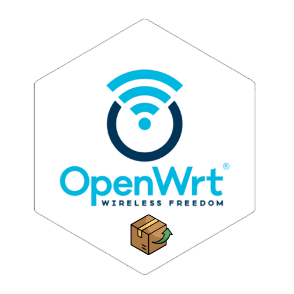

<div align="center">
  

**Custom OpenWrt package feed with extra packages missing from official repositories**

[](https://github.com/nooblk-98/noobwrt-custom-feeds/actions/workflows/sync-packages.yml)
[](http://www.gnu.org/licenses/agpl-3.0)
[](https://github.com/nooblk-98/noobwrt-custom-feeds/commits/main)
[](https://github.com/nooblk-98/noobwrt-custom-feeds/blob/main/CONTRIBUTING.md)


</div>

---


# Noobwrt custom Packages

All packages are automatically synchronized with their original repositories **every day** and kept up-to-date with the latest changes and security updates.

## Quick Start

Add this line to your OpenWrt SDK's `feeds.conf` file:

```bash
echo "src-git noobwrt https://github.com/nooblk-98/noobwrt-custom-feeds.git;main" >> feeds.conf.default
```

## Packages Included


| packages |      |    |    |
| :-------- | :------- | :--------  |:-------- |
| `luci-app-passwall` | `luci-app-modemdata` | `luci-app-qmodem` | `luci-app-bandix` |
| `luci-app-adguardhome` | `luci-app-wrtbwmon` | `luci-app-bandix` | `luci-proto-amneziawg` |
| `luci-app-internet-detector` | `luci-theme-alpha` | `luci-app-alpha-config` | `luci-app-aw1k-led` |
| `luci-app-ipinfo` | `luci-app-netstat` | `luci-app-tailscale` | `luci-app-tinyfilemanager` |
| `luci-theme-carbonpx` | `luci-theme-argon` | `luci-app-argon-config` | `luci-theme-peditx` |
| `luci-app-sms-tool-js` | `luci-app-cpu-status-mini` | `luci-app-diskman` | `luci-app-cpu-status` |
| `luci-app-passwall2` | `luci-app-qbittorrent` | `luci-app-3ginfo` | `luci-app-clash` |
| `luci-app-alwaysonline` | `luci-app-netspeedtest` |  |  |


## Contribute Your Packages

Do you have a favorite custom package? We'd love to have it here! Feel free to submit a pull request and add your custom packages to this repository.
