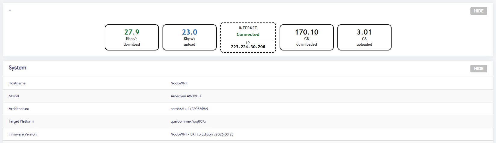
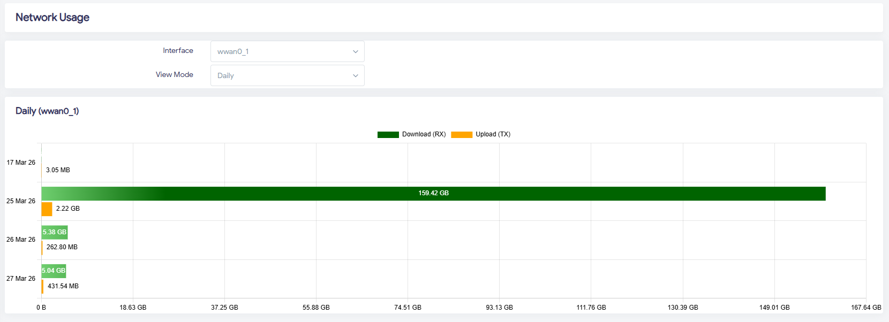

# luci-app-netstat

<div align="center">

**A professional network statistics application for OpenWrt LuCI**

[](LICENSE)
[](Makefile)


[Features](#features) • [Installation](#installation) • [Usage](#usage) • [Development](#development) • [License](#license)

</div>

---

## Overview





**luci-app-netstat** is a modern, feature-rich LuCI application that provides comprehensive network traffic statistics and monitoring for OpenWrt routers. It leverages `vnstat` for accurate traffic monitoring and presents the data through an intuitive web interface.

The application offers real-time network statistics, historical data visualization, and detailed traffic analysis to help you understand your network usage patterns.

## Features

✨ **Core Features:**
- 📊 **Real-time Network Monitoring** - Track network traffic with live statistics
- 📈 **Traffic Visualization** - Interactive charts powered by Chart.js
- 📅 **Historical Data** - Monitor trends over days, weeks, months, and years
- 🎨 **Dark Mode Support** - Professional dark theme for comfortable usage
- 📱 **Responsive Design** - Works seamlessly on desktop and mobile devices
- ⚙️ **Easy Configuration** - Simple UCI-based configuration system
- 🔄 **Automatic Updates** - Uses vnstat for continuous data collection

## Requirements

- OpenWrt with LuCI installed
- `vnstat` package (required dependency)
- Modern web browser (Chrome, Firefox, Safari, Edge)

## Installation

### Automatic Installation

Clone the repository and install using the OpenWrt build system:

```bash
git clone https://github.com/dotycat/luci-app-netstat.git
cd luci-app-netstat
make
```

### Manual Installation

1. Download the latest `.ipk` package from [Releases](../../releases)
2. Upload to your router via SCP:
   ```bash
   scp luci-app-netstat_*.ipk root@<router-ip>:/tmp/
   ```
3. Install via SSH:
   ```bash
   ssh root@<router-ip>
   opkg install /tmp/luci-app-netstat_*.ipk
   ```
4. Navigate to **LuCI Web Interface** → **Status** → **Network Statistics**

## Configuration

### UCI Configuration

The application configuration is managed via UCI. Edit `/etc/config/netstats` to customize:

```
config netstat
    option enabled '1'
    option interface 'wan'
    option update_interval '60'
```

### vnstat Integration

Ensure vnstat is properly configured and running:

```bash
opkg install vnstat
service vnstat start
service vnstat enable
```

## Usage

### Dashboard

1. Log into your OpenWrt LuCI web interface
2. Navigate to **Status** → **Network Statistics**
3. View traffic statistics for your network interfaces

### Available Data

- **Current Usage** - Real-time traffic rates
- **Daily Statistics** - Traffic breakdown by day
- **Monthly Analysis** - Monthly usage overview

## Credits

- **Original Development**: [SMALLPROGRAM](https://github.com/smallprogram)
- **Maintenance**: [nooblk-98](https://github.com/nooblk-98/)


## Contributing

Contributions are welcome! Please feel free to:
- Report bugs and issues
- Submit feature requests
- Create pull requests with improvements
- Improve documentation

## Support

For support, issues, or questions:
- Open an [Issue](../../issues) on GitHub
- Check existing [Discussions](../../discussions)
- Contact: liyanagelsofficial@gmail.com

---

<div align="center">

**Made with ❤️ for the OpenWrt Community**

</div>
