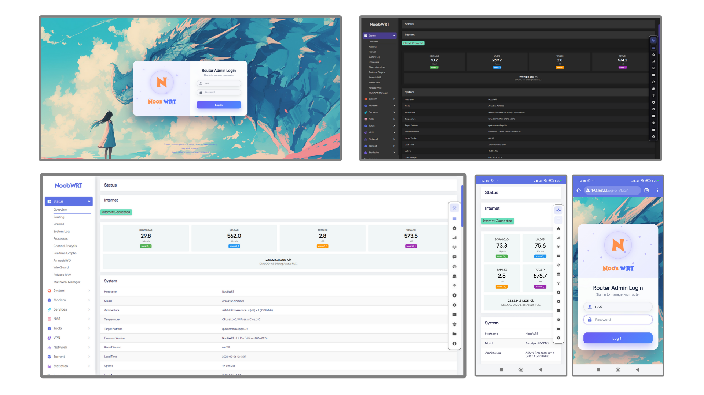

<!-- markdownlint-configure-file {
  "MD013": {
    "code_blocks": false,
    "tables": false,
    "line_length":200
  },
  "MD033": false,
  "MD041": false
} -->

[license]: /LICENSE
[license-badge]: https://img.shields.io/github/license/nooblk-98/luci-theme-noobwrt?style=flat-square&a=1
[prs]: https://github.com/nooblk-98/luci-theme-noobwrt/pulls
[prs-badge]: https://img.shields.io/badge/PRs-welcome-brightgreen.svg?style=flat-square
[issues]: https://github.com/nooblk-98/luci-theme-noobwrt/issues/new
[issues-badge]: https://img.shields.io/badge/Issues-welcome-brightgreen.svg?style=flat-square
[release]: https://github.com/nooblk-98/luci-theme-noobwrt/releases
[release-badge]: https://img.shields.io/github/v/release/nooblk-98/luci-theme-noobwrt?style=flat-square
[download]: https://github.com/nooblk-98/luci-theme-noobwrt/releases
[download-badge]: https://img.shields.io/github/downloads/nooblk-98/luci-theme-noobwrt/total?style=flat-square
[contact]: https://t.me/jerryk6
[contact-badge]: https://img.shields.io/badge/Contact-telegram-blue?style=flat-square
[en-us-link]: /README.md
[zh-cn-link]: /README_ZH.md
[en-us-release-log]: /RELEASE.md
[zh-cn-release-log]: /RELEASE_ZH.md
[config-link]: https://github.com/jerrykuku/luci-app-noobwrt-config/releases
[lede]: https://github.com/coolsnowwolf/lede
[official]: https://github.com/openwrt/openwrt
[immortalwrt]: https://github.com/immortalwrt/immortalwrt


# A brand new LuCI theme NoobWRT

NoobWrt is <strong>a clean and tidy OpenWrt LuCI theme</strong> that allows users to customize their login interface with images or videos.  It also supports automatic and manual switching between light and dark modes.


<p align="center">
  <a href="https://github.com/nooblk-98/luci-theme-noobwrt/blob/master/LICENSE">
    
  </a>
  <a href="https://github.com/nooblk-98/luci-theme-noobwrt/pulls">
    
  </a>
  <a href="https://github.com/nooblk-98/luci-theme-noobwrt/issues/new">
    
  </a>
  <a href="https://github.com/nooblk-98/luci-theme-noobwrt/releases">
    
  </a>
  <a href="https://github.com/nooblk-98/luci-theme-noobwrt/releases">
    
  </a>
</p>



</div>

## luci-theme-noobwrt

> **About this theme **
>
> "This theme originates from luci-theme-aragon but has been extensively modified and enhanced with additional features specifically for the NoobWrt firmware. It provides a clean, modern, and highly customizable interface for your OpenWrt router, focusing on user experience and visual appeal."


## Getting started


### Build for OpenWrt official SnapShots and ImmortalWrt

```bash
cd openwrt/package
git clone https://github.com/nooblk-98/luci-theme-noobwrt.git
make menuconfig #choose LUCI->Theme->Luci-theme-noobwrt
make -j1 V=s
```

## Credits

[luci-theme-material](https://github.com/LuttyYang/luci-theme-material/)
[luci-theme-argon](https://github.com/jerrykuku/luci-theme-argon/)


