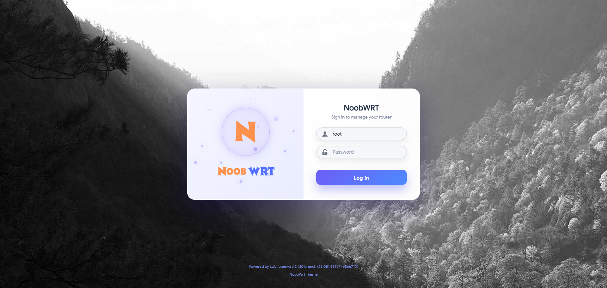
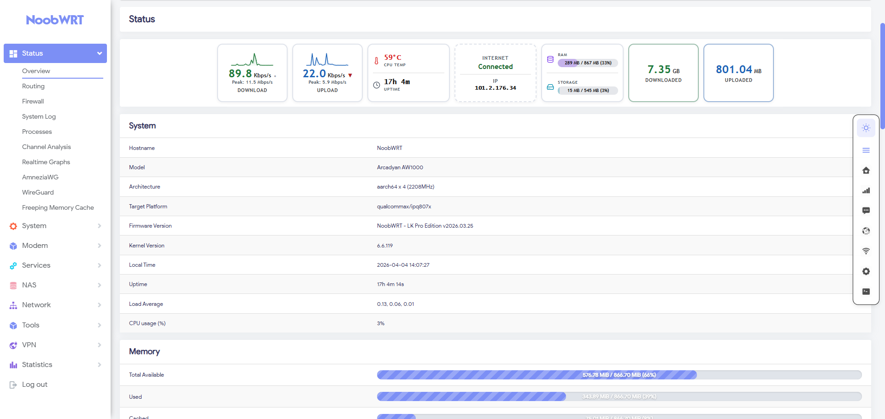
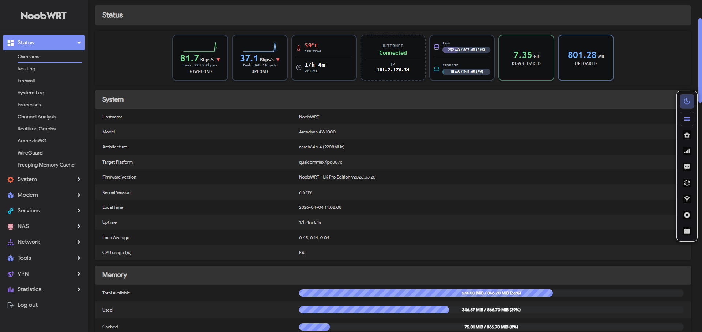
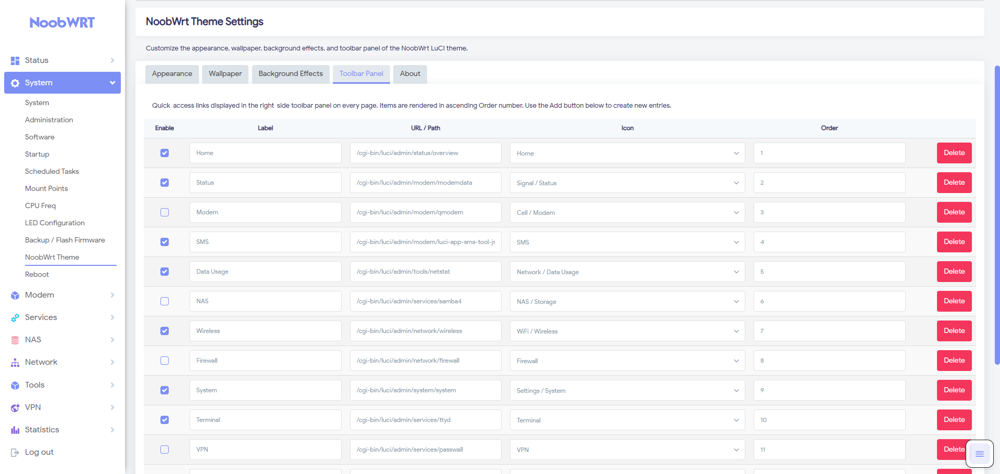
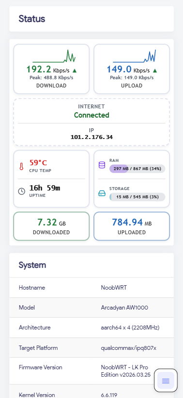
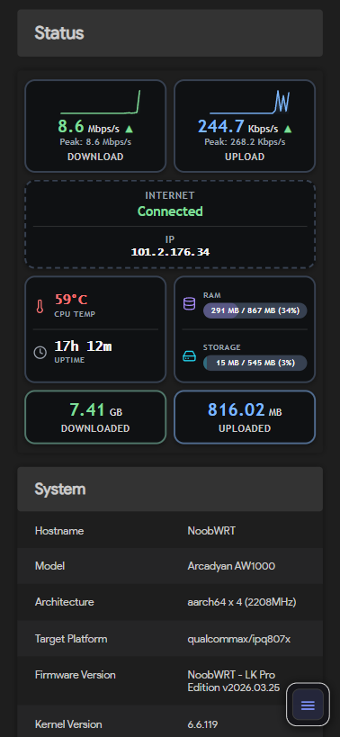
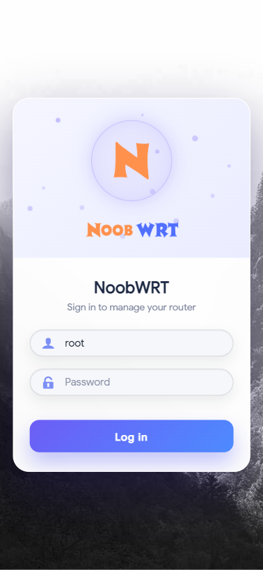

<!-- markdownlint-configure-file {
  "MD013": {
    "code_blocks": false,
    "tables": false,
    "line_length":200
  },
  "MD033": false,
  "MD041": false
} -->

[license]: /LICENSE
[license-badge]: https://img.shields.io/github/license/nooblk-98/luci-theme-noobwrt?style=flat-square&a=1
[prs]: https://github.com/nooblk-98/luci-theme-noobwrt/pulls
[prs-badge]: https://img.shields.io/badge/PRs-welcome-brightgreen.svg?style=flat-square
[issues]: https://github.com/nooblk-98/luci-theme-noobwrt/issues/new
[issues-badge]: https://img.shields.io/badge/Issues-welcome-brightgreen.svg?style=flat-square
[release]: https://github.com/nooblk-98/luci-theme-noobwrt/releases
[release-badge]: https://img.shields.io/github/v/release/nooblk-98/luci-theme-noobwrt?style=flat-square
[download]: https://github.com/nooblk-98/luci-theme-noobwrt/releases
[download-badge]: https://img.shields.io/github/downloads/nooblk-98/luci-theme-noobwrt/total?style=flat-square
[official]: https://github.com/openwrt/openwrt
[immortalwrt]: https://github.com/immortalwrt/immortalwrt


# NoobWRT LuCI Theme

> A clean, modern OpenWrt LuCI theme with live wallpapers, animated progress bars, automatic light/dark scheduling, customizable accent colors, and a quick-access toolbar.

<p align="center">
  <a href="https://github.com/nooblk-98/luci-theme-noobwrt/blob/master/LICENSE">
    
  </a>
  <a href="https://github.com/nooblk-98/luci-theme-noobwrt/pulls">
    
  </a>
  <a href="https://github.com/nooblk-98/luci-theme-noobwrt/issues/new">
    
  </a>
  <a href="https://github.com/nooblk-98/luci-theme-noobwrt/releases">
    
  </a>
  <a href="https://github.com/nooblk-98/luci-theme-noobwrt/releases">
    
  </a>
</p>

<br>

<p align="center">
  
</p>

---

## Preview

<p align="center">
  <a href="https://www.youtube.com/watch?v=pxMpUKWQ3nU">
    
  </a>
  <br>
  <sub><b>▶ Watch on YouTube</b></sub>
</p>

---

## Screenshots

### Desktop

<table>
  <tr>
    <td align="center" width="50%">
      
      <br><sub><b>Overview — Light Mode</b></sub>
    </td>
    <td align="center" width="50%">
      
      <br><sub><b>Overview — Dark Mode</b></sub>
    </td>
  </tr>
  <tr>
    <td align="center" colspan="2">
      
      <br><sub><b>Theme Settings — Toolbar Panel</b></sub>
    </td>
  </tr>
</table>

### Mobile

<table>
  <tr>
    <td align="center" valign="top" width="33%">
      
      <br><sub><b>Mobile — Status (Light)</b></sub>
    </td>
    <td align="center" valign="top" width="33%">
      
      <br><sub><b>Mobile — Status (Dark)</b></sub>
    </td>
    <td align="center" valign="top" width="33%">
      
      <br><sub><b>Mobile — Login</b></sub>
    </td>
  </tr>
</table>

---

## Features

- **Animated progress bars** — diagonal stripe animation using your accent color
- **Online wallpapers** — Bing Daily Photo, Lorem Picsum, or Wikimedia Picture of the Day, no API key required
- **Custom wallpaper upload** — upload your own JPG/PNG/WebP login background
- **Accent color picker** — separate colors for light and dark mode, applied everywhere
- **Automatic Light / Dark scheduling** — switches to Dark from 6 PM to 6 AM and Light from 6 AM to 6 PM automatically; enable/disable in settings (default: enabled)
- **Light / Dark mode** — manual toggle via toolbar sun/moon button; respects OS preference when auto-schedule is off
- **Quick-access toolbar** — slides in from the right edge; hover the `‹` tab to peek, click to pin open/closed
- **Blur & opacity controls** — fine-tune the login page background effect
- **Responsive** — works on desktop and mobile

---

## Theme Settings

Go to **System → NoobWrt Theme** in the LuCI menu.

### Appearance

| Option | Description |
|--------|-------------|
| **Automatic Light / Dark Mode** | When enabled (default), the theme switches to Dark from **6 PM to 6 AM** and to Light from **6 AM to 6 PM** automatically. The toolbar toggle still works but the schedule takes effect on the next minute tick. Disable to use manual mode. |
| **Default Theme Mode** | `Light` or `Dark` — applied on page load when Automatic mode is disabled. Toggle anytime via the toolbar sun/moon button. |
| **Accent Color — Light Mode** | Hex color for the light theme, e.g. `#5e72e4`. Used for progress bars, buttons, active states. |
| **Accent Color — Dark Mode** | Hex color for the dark theme, e.g. `#7c8ff5`. |

### Wallpaper

| Action | Description |
|--------|-------------|
| **Online Wallpaper Source** | `Bing Daily Photo`, `Lorem Picsum (Random)`, or `Wikimedia Picture of the Day`. Set to `None` to use a custom upload or the default. |
| **Upload Wallpaper** | Upload a JPG, PNG, or WebP image (max 10 MB) as the login background. |
| **Revert to Default** | Remove the custom wallpaper and restore the built-in default. |

> Online sources are cached for 12 hours. Delete `/var/run/noobwrt_*.url` on the router to force a refresh.

### Background Effects

| Option | Description |
|--------|-------------|
| **Blur Radius — Light Mode** | Background blur in pixels, light mode. Default: `10` |
| **Blur Radius — Dark Mode** | Background blur in pixels, dark mode. Default: `10` |
| **Background Opacity — Light Mode** | Overlay opacity, `0.0` (transparent) to `1.0` (opaque). Default: `0.8` |
| **Background Opacity — Dark Mode** | Overlay opacity, dark mode. Default: `0.8` |

### Toolbar Panel

The toolbar is a quick-access icon panel fixed to the right edge of every page.

**Behaviour:**
- A `‹` tab is always visible on the right edge. **Hover** it to slide the panel in temporarily — move the mouse away and it slides back.
- **Click** the tab to pin the panel open or closed. The state is saved across page loads.

| Field | Description |
|-------|-------------|
| **Enable** | Show or hide this item. |
| **Label** | Tooltip text shown on hover. |
| **URL / Path** | Destination URL, e.g. `/cgi-bin/luci/admin/status/overview`. |
| **Icon** | Choose from: Home, Signal, Cell, SMS, Network, NAS, WiFi, Firewall, Settings, Terminal, VPN, Files, Info. |
| **Order** | Position in the toolbar — lower numbers appear first. |

---

## Installation

### Install via opkg

Download the latest `.ipk` from [Releases](https://github.com/nooblk-98/luci-theme-noobwrt/releases) and run:

```bash
opkg install luci-theme-noobwrt_*.ipk
```

### Build from source

```bash
cd openwrt/package
git clone https://github.com/nooblk-98/luci-theme-noobwrt.git
make menuconfig  # LUCI → Themes → luci-theme-noobwrt
make -j1 V=s
```

---

## Credits

- [luci-theme-argon](https://github.com/jerrykuku/luci-theme-argon/) — original inspiration
- [luci-theme-material](https://github.com/LuttyYang/luci-theme-material/)
