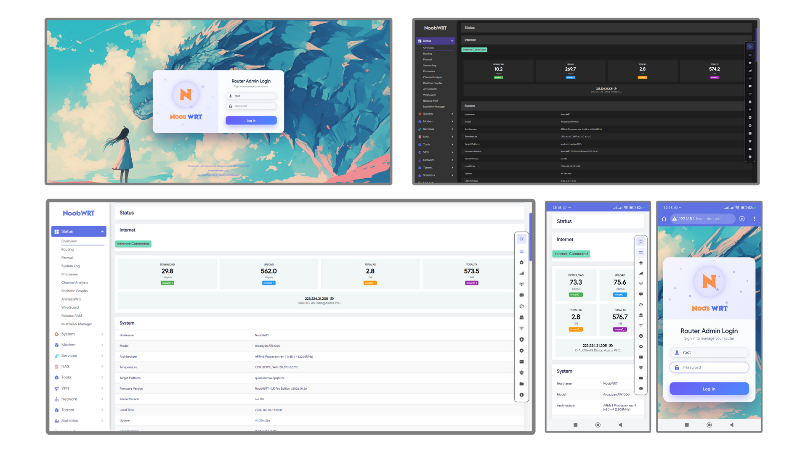

<!-- markdownlint-configure-file {
  "MD013": {
    "code_blocks": false,
    "tables": false,
    "line_length":200
  },
  "MD033": false,
  "MD041": false
} -->

[license]: /LICENSE
[license-badge]: https://img.shields.io/github/license/nooblk-98/luci-theme-noobwrt?style=flat-square&a=1
[prs]: https://github.com/nooblk-98/luci-theme-noobwrt/pulls
[prs-badge]: https://img.shields.io/badge/PRs-welcome-brightgreen.svg?style=flat-square
[issues]: https://github.com/nooblk-98/luci-theme-noobwrt/issues/new
[issues-badge]: https://img.shields.io/badge/Issues-welcome-brightgreen.svg?style=flat-square
[release]: https://github.com/nooblk-98/luci-theme-noobwrt/releases
[release-badge]: https://img.shields.io/github/v/release/nooblk-98/luci-theme-noobwrt?style=flat-square
[download]: https://github.com/nooblk-98/luci-theme-noobwrt/releases
[download-badge]: https://img.shields.io/github/downloads/nooblk-98/luci-theme-noobwrt/total?style=flat-square
[contact]: https://t.me/jerryk6
[contact-badge]: https://img.shields.io/badge/Contact-telegram-blue?style=flat-square
[en-us-link]: /README.md
[zh-cn-link]: /README_ZH.md
[en-us-release-log]: /RELEASE.md
[zh-cn-release-log]: /RELEASE_ZH.md
[config-link]: https://github.com/jerrykuku/luci-app-noobwrt-config/releases
[lede]: https://github.com/coolsnowwolf/lede
[official]: https://github.com/openwrt/openwrt
[immortalwrt]: https://github.com/immortalwrt/immortalwrt


# A brand new LuCI theme NoobWRT

NoobWrt is <strong>a clean and tidy OpenWrt LuCI theme</strong> that allows users to customize their login interface with images or videos.  It also supports automatic and manual switching between light and dark modes.


<p align="center">
  <a href="https://github.com/nooblk-98/luci-theme-noobwrt/blob/master/LICENSE">
    
  </a>
  <a href="https://github.com/nooblk-98/luci-theme-noobwrt/pulls">
    
  </a>
  <a href="https://github.com/nooblk-98/luci-theme-noobwrt/issues/new">
    
  </a>
  <a href="https://github.com/nooblk-98/luci-theme-noobwrt/releases">
    
  </a>
  <a href="https://github.com/nooblk-98/luci-theme-noobwrt/releases">
    
  </a>
</p>



</div>

## luci-theme-noobwrt

> **About this theme **
>
> "NoobWRT Theme is a modern and extensively customized OpenWrt LuCI theme with unique features and enhancements specifically designed for the NoobWrt firmware. This is now an independent project providing a clean, modern, and highly customizable interface for your OpenWrt router, with a focus on user experience and visual appeal."
>
> Originally inspired by luci-theme-argon, this project has evolved into its own distinctive theme with unique features and continuous improvements.


## Theme Settings

The settings page is available at **System → NoobWrt Theme** in the LuCI menu.

---

### Appearance

| Option | Description |
|--------|-------------|
| **Default Theme Mode** | Sets the theme applied on page load — `Light` or `Dark`. Users can toggle at any time using the sun/moon button in the toolbar. |
| **Accent Color — Light Mode** | Primary accent color used in the light theme. Enter a hex value, e.g. `#5e72e4`. |
| **Accent Color — Dark Mode** | Primary accent color used in the dark theme. Enter a hex value, e.g. `#7c8ff5`. |

---

### Wallpaper

Customize the login page background image.

| Action | Description |
|--------|-------------|
| **Upload Wallpaper** | Upload a custom JPG, PNG, or WebP image (max 10 MB) to use as the login page background. A preview is shown after upload. |
| **Revert to Default** | Removes the custom wallpaper and restores the built-in default background. |

> The uploaded wallpaper takes effect on the login page immediately. If an online wallpaper source is configured, it takes priority over the custom upload.

---

### Background Effects

Controls the visual effects applied to the login page background.

| Option | Description |
|--------|-------------|
| **Blur Radius — Light Mode** | How much the background image is blurred (in pixels) in light mode. Default: `10` |
| **Blur Radius — Dark Mode** | How much the background image is blurred (in pixels) in dark mode. Default: `10` |
| **Background Opacity — Light Mode** | Opacity of the overlay on top of the background in light mode. Range: `0.0` (fully transparent) to `1.0` (fully opaque). Default: `0.8` |
| **Background Opacity — Dark Mode** | Opacity of the overlay in dark mode. Default: `0.8` |

---

### Toolbar Panel

Manage the quick-access icon buttons displayed in the right-side toolbar on every page.

Each item has the following fields:

| Field | Description |
|-------|-------------|
| **Enable** | Toggle to show or hide this item in the toolbar. |
| **Label** | Display name shown as a tooltip when hovering over the icon. |
| **URL / Path** | The page to navigate to when the icon is clicked. Can be a full URL or a LuCI path like `/cgi-bin/luci/admin/status/overview`. |
| **Icon** | Icon image to display. Choose from the built-in icon set (Home, Signal, Cell, SMS, Network, NAS, WiFi, Firewall, Settings, Terminal, VPN, Files, Info). |
| **Order** | Controls the position of the item in the toolbar. Lower numbers appear first. |

Use **Add** to create new toolbar items and **Remove** to delete existing ones. Click **Save & Apply** to apply changes.

---

### About

Displays theme information including the version, developer, repository link, and license.

---

## Installation

### Install via opkg (recommended)

Download the latest `.ipk` from [Releases](https://github.com/nooblk-98/luci-theme-noobwrt/releases) and install:

```bash
opkg install luci-theme-noobwrt_*.ipk
```

### Build from source

```bash
cd openwrt/package
git clone https://github.com/nooblk-98/luci-theme-noobwrt.git
make menuconfig  # LUCI → Themes → luci-theme-noobwrt
make -j1 V=s
```

## Credits

- [luci-theme-argon](https://github.com/jerrykuku/luci-theme-argon/) — original inspiration
- [luci-theme-material](https://github.com/LuttyYang/luci-theme-material/)
